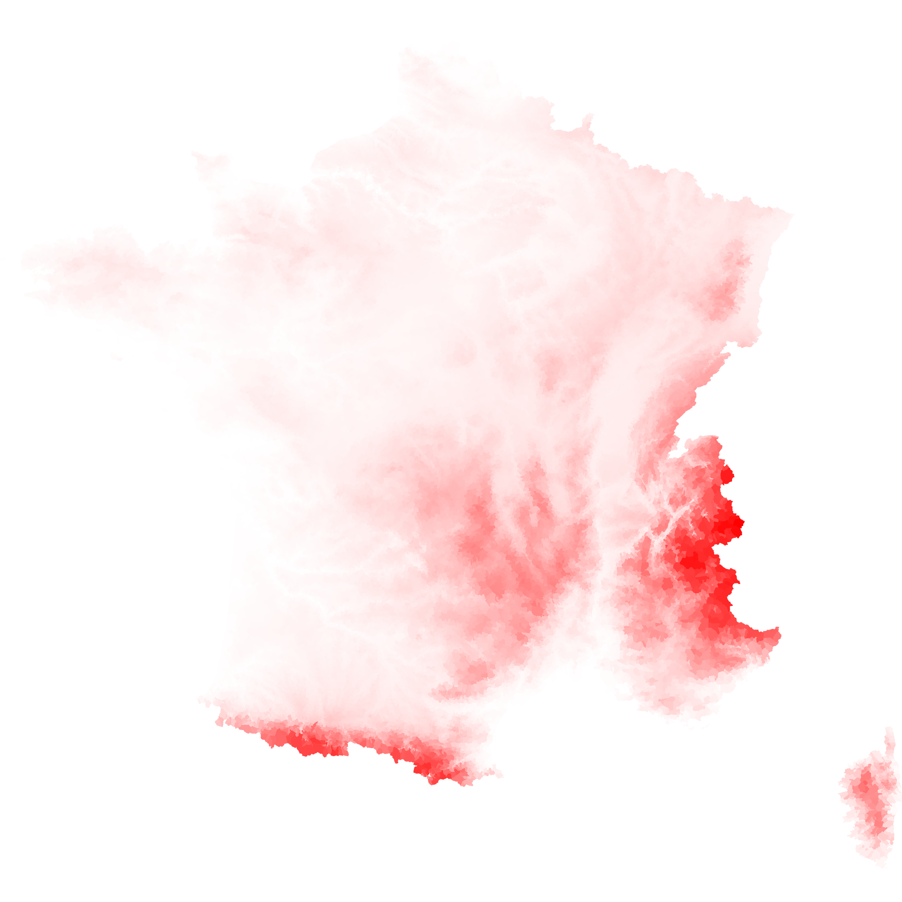

# how-to-draw-a-canvas-map

Le but de ce projet est de montrer comment générer une carte en canvas.
Nous travaillons avec [canvas côté node](https://github.com/Automattic/node-canvas), mais le principe est le même côté client.
 
Il est parfois pénible de travailler avec du SVG lorsqu'on a beaucoup d'objet - si l'on 
veut réaliser une carte au niveau communale par exemple. Le canvas est l'outil idéal car
il n'est finalement qu'une marice de pixels, donc très léger.

## [d3] et le canvas

[d3] permet assez facilement de travailler avec le canvas :
 
L'essentiel est de récupérer le context du canvas comme suit :

```javascript
// canvas init
const canvas = new Canvas(size, size);
const context = canvas.getContext('2d');
```

Les path generators de [d3] contiennent toujours un paramètre optionnel `context` :

```javascript
// path generator
const pathGen: Function = geoPath()
  .projection(projection)
  .context(context);
```

Il suffit ensuite d'appeler le generator pour dessiner un path :

```javascript
geojson.features.forEach(feature => {
  context.beginPath();
  pathGen(feature);
  const color = _.flow(getZ, scaleZ)(feature);
  context.strokeStyle = color;
  context.fillStyle = color;
  context.stroke();
  context.fill();
  context.closePath();
});
```



[d3]: https://d3js.org/